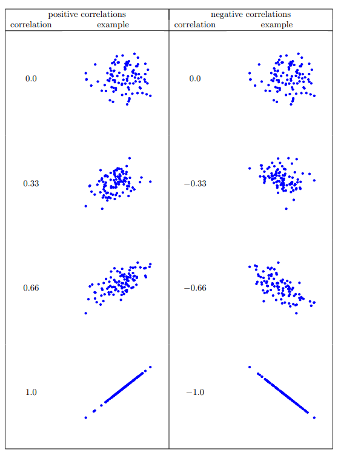

```{r}


```

# Pearson koreliacijos koeficientas

Pearson'o koreliacijos koeficientą labai nesudėtinga paaiškinti: įsivaizduokime tiesę, kurią nubrėžtume su funkcija y = f(x):

```{r, echo = FALSE}

library(ggplot2)
library(patchwork)

perfect_line <- data.frame(y = 1:10, x = 1:10)

pos_line <- ggplot(perfect_line, aes(x = x, y = y)) + geom_line() + labs(title = "Tobula teigiama koreliacija")

neg_line <- ggplot(perfect_line, aes(x = x, y = -1*y)) + geom_line() + labs(title = "Tobula neigiama koreliacija")

pos_line / neg_line

```

Nelendant į matematines detales, kuo arčiau mūsų matavimai yra arčiau šios linijos, tuo koreliacijos koeficientas bus didesnis. Priešingai, jeigu taškai yra arčiau linijos, kuomet y reikšmės mažėja didėjant x reikšmėms, tuo koreliacijos koeficientas bus mažesnis. Koreliacijos koeficientas 1,0 ir -1,0 yra šios linijos.

Pajutimui, taip atrodo duomenys su skirtingais koreliacijos koeficientais[^1]:

[^1]: Taip pat labai rekomenduoju šitą žaidimą išbandyti intuiciją apie koreliacijas: https://www.guessthecorrelation.com/



Apskaičiuoti koreliacijos koeficientą galima ir su R, ir su Excel:

::: panel-tabset
## R

R `cor()` funkcija leidžia lyginti kelis stulpelis iškart, o cor.test() taip pat pateikia statistinio testo rezultatus.

```{r}

cor.test(iris$Sepal.Length, iris$Sepal.Width)

```

Statistinio testo rezultatai šiuo atveju nėra visiškai sąžiningi, nes tai yra tiesinės regresijos rezultatai. Juos laisvai galima raportuoti, bet tai parodo, jog tikriausiai norime tiesiog atlikti tiesinę regresiją.

## Excel

Excel grąžina tik patį koreliacijos koeficientą, bet su XLMiner Toolpak galima lyginti kelis stulpelius vienu metu!


:::

# Spearman koreliacijos koeficientas

Pearson'o koreliacijos pagrindinis trūkumas - jis tinkamas tiesiniams ryšiams. Kitaip tariant, koreliacijos koeficientas nusako, kaip gerai mūsų dviejų kintamųjų matavimai nugula aplinkui tobulą tiesę (r = 1.0). Tais atvejais, kai ryšys nėra tiesiškas, pavyzdžiui, truputis pastangų rengiantis egzaminui turės didelę įtaką pažymiui (tarkim, nuo 4 iki 7), bet papildomos pastangos padidins pažymį tik truputį (nuo 7 iki 8), Pearson'o koreliacijos koeficientas nepateiks teisingo įverčio. Tokiu atveju turime naudoti Spearman'o koreliaciją.

Naudodami koreliacijas tikriausiai vengiame gudrių statistinių modelių, todėl šiuo atveju Spearman koreliacija yra labai analogiška Wilcoxon dviejų imčių testui arba Kruskal-Wallis testui. Pirma, mūsų duomenų rinkinys yra paverčiamas į rangines reikšmes, o tada - skaičiuojamas gautų rangų koreliacijos koeficientas.

```{r}

cor.test(iris$Sepal.Length, iris$Sepal.Width, method = "spearman")

```

# Kaip raportuoti koreliaciją?

# 
