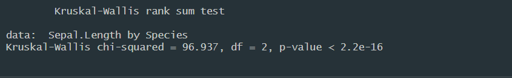

# Parsisiųsti RStudio

Parsisiųsti RStudio galima iš [Posit svetainės](https://posit.co/download/rstudio-desktop/). Pirmą kartą atsidarius RStudio jus pasitiks toks langas:


Nepasimeskite! Jis sudarytas iš keturių dalių:


-   .R failo erdvė - tai yra atidaryto failo redaktorius. Jeigu norime rašyti komandas, bet nebūtinai jas iškart paleisti, jas rašome šioje erdvėje.

-   Konsolė - tai yra vieta, kur R mums spausdins pranešimų žinutes bei galėsime įvesti komandas, kurios būtų iškart paleidžiamos.

-   Užkrauti duomenys - tai yra langas, kuris rodo, kokie duomenų rinkiniai yra užkrauti į R aplinką

-   Failų naršyklė - tai yra langas, kuris atitinka *File Explorer.*

Gali būti, jog pirmąkart atsidarius RStudio jums rodys tik 3 langus. Taip yra dėl to, jog neturime atsidarę jokio failo, kuriame būtų galima rašyti kodą. Naują failą galima atsidaryti su klavišų trumpiniu *Ctrl + Shift + N*.

# Parsisiųsti reikalingus paketus

R yra programavimo kalba, kuri savaime yra pritaikyta statistinėms analizėms. Dėl to nemažai funkcijų jau galima naudoti be papildomų žingsnių, bet kai kurie funkcionalumai turi būti papildomai įdiegti su **bibliotekomis**. Bibliotekos yra funkcijų rinkiniai, kuriuos kiti žmonės sukuria, jog išplėstų R funkcionalumą. Pavyzdžiui, **ggplot2** biblioteka yra nepamainoma grafikų vizualizavimui.

Nusikopijuokite komandą žemiau į savo **konsolę** ir spauskite **Enter**:

```{r, eval = FALSE}

install.packages(c("ggplot2","knitr","dplyr","readxl"))

```

Komanda įdiegs reikalingas bibliotekas iš CRAN (dedikuotas serveris, kuris saugo bibliotekas) archyvo. Gali būti, jog susidursite su tokiu pranešimu:

{alt="Jeigu RStudio rodo tokį pranešimą, spauskite \"No"}

RStudio šiuo pranešimu siūlo pirma sukompiliuoti biblioteką, o tik tada ją diegti. Rekomenduoju rinktis "**No**", nes diegimas bus greitesnis, taip pat kai kurių bibliotekų kompiliavimui reikalingi papildomi funkcionalumai.

# Pirmoji komanda

Jeigu iki šiol sėkmingai pavyko viską padaryti, pabandykite įkopijuoti šią komandą į savo konsolę ir paleiskite ją su Enter:

```{r, eval = FALSE}

kruskal.test(data = iris, Sepal.Length ~ Species)

```

Turėjote **konsolėje** pamatyti panašų vaizdą:



Dabar pabandykite susikurti naują failą (Ctrl+Shift+N) ir:

-   Įkopijuokite tą pačią komandą į savo sukurtą failą

-   Pasirinkite (pažymėkite lyg norėtume kopijuoti) įkopijuotą komandą

-   Paspauskite **Ctrl + Enter**

Jeigu viskas gerai, **konsolėje** turėjote gauti tokį patį pranešimą kaip praeitą kartą, bet dabar turite ir kodo gabaliuką, kurį galite naudokite pakartotinai.

# 
