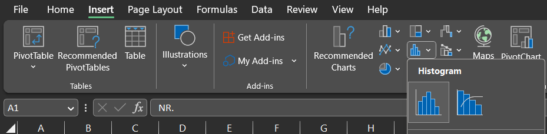

Atlikote tyrimą, duomenis surinkote ir dabar norite juos analizuoti - puiku! Kaip užtikrinti, jog surinkote kokybiškus duomenis ir jog taikote teisingą statistinį testą? Šiame straipsnyje apžvelgsime, kaip patikrinti tolydžių duomenų kokybę ir kaip juos galima analizuoti.

# Kaip patikrinti, jog duomenys teisingi?

Kai duomenų kiekis yra mažas, perbėgti duomenis akimis yra paprasčiausia - keliskart didesnės reikšmės praktiškai visada iššoka ir kelia klausimų. Kai duomenų kiekis yra per didelis patikrinti tiesiog "žiūrint" į duomenis, aš tikrinu duomenų histogramą. Histograma yra labai patogus įrankis, nes jis iškart atskleidžia, ar nėra išskirčių, taip pat leidžia pasitvirtinti, ar duomenys yra pasiskirstę pagal mūsų išankstinius lūkesčius.

Histogramą su R galima nubraižyti su `ggplot2` biblioteka:

```{r}

library(ggplot2)

ggplot(iris, aes(x = Sepal.Length)) + geom_histogram(binwidth = 0.1) + labs(title = "Nėra neįprastų reikšmių", subtitle = "Duomenų rinkinį skaidome pagal rūšis, nes rūšys savaime skiriasi savo žiedlapių dydžiu.") + facet_wrap(~Species)


```

O viduje Excel yra Histogramos įrankis:



Antras būdas tikrinti, ar viskas gerai su duomenimis, yra patikrinti, ar nėra trūkstamų reikšmių ir kokios yra didžiausios bei mažiausios reikšmės.


Ką šiaip reikia tikrinti, jog nepersišautum kojos?

* Normalumas
* Ekstremalios reikšmės

